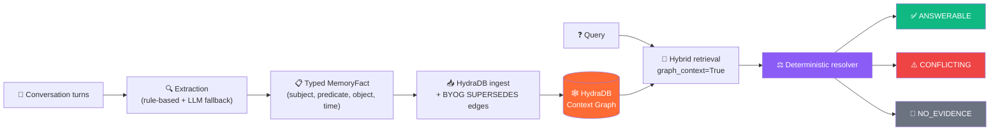

<div align="center">

# 🧠 HydraMem

### Graph-Native Temporal Memory for AI Agents

**Hack Hydra 2026 · Track 3 — Memory + Context Retrieval**

> *Vector stores guess which fact is current. HydraMem **knows** — because time is a graph edge, not metadata.*

[](LICENSE)
[](https://www.python.org)
[](https://hydradb.com)
[](https://hackhydra.hydradb.com)
[](app.py)

[**Demo Video**](TODO_YOUTUBE_LINK) · [**Live Demo**](TODO_DEPLOYED_LINK_OR_REMOVE) · [**Hack Hydra Submission**](https://hackhydra.hydradb.com)

</div>

---

## 📖 Table of Contents

- [The Problem](#-the-problem)
- [The Solution](#-the-solution)
- [Architecture](#-architecture)
- [Quickstart](#-quickstart)
- [The API](#-the-api)
- [Live Demo Output](#-live-demo-output)
- [How We Use HydraDB](#-how-we-use-hydradb)
- [Benchmarks](#-benchmarks)
- [Performance & Cost](#-performance--cost)
- [Streamlit UI](#-streamlit-ui)
- [Project Structure](#-project-structure)
- [Datasets](#-datasets)
- [Known Limitations](#-known-limitations)
- [License & Attribution](#-license--attribution)

---

## 🎯 The Problem

Agent memory layers (mem0, basic RAG) fail the moment facts **change over time**.

If a user says *"I live in New York"* in Session 1 and *"I moved to London"* in Session 2, a vector store retrieves **both** and lets the LLM guess which one is current. It has no structural concept of:

| Challenge | What goes wrong |
|:---|:---|
| ⏳ **Chronology** | All facts look equally "relevant" to similarity search |
| 🔁 **Overwritten facts** | Nothing marks New York as *superseded* by London |
| 🕳️ **Missing information** | Vector stores always return *something* — they can't abstain |
| 🤝 **Multi-hop facts** | "Where does the user's manager live?" spans two unrelated chunks |

The [Track 3 brief](https://hackhydra.hydradb.com) nails it: long-context models drop **30–60% in accuracy here, mostly by failing at abstention**.

---

## 💡 The Solution

**HydraMem** replaces similarity-ranked guessing with **deterministic, graph-native temporal resolution**, built on [HydraDB](https://hydradb.com)'s Context Graphs and Bring-Your-Own-Graph (BYOG).

When a new fact arrives, HydraMem declares an explicit **`SUPERSEDES`** edge to the previous fact of the same property. Time becomes a **graph edge**, not metadata. At query time, a deterministic resolver walks the chain and returns one of three first-class states:

<div align="center">

| ✅ `ANSWERABLE` | ⚠️ `CONFLICTING` | 🚫 `NO_EVIDENCE` |
|:---:|:---:|:---:|
| Terminal fact in the revision chain wins | Contradictory values at the same timestamp | The answer isn't in the history — say so, don't invent |

</div>



### ✨ Key Features

- 🕸️ **Explicit temporal graph** — `SUPERSEDES` edges declared at ingest via BYOG
- 🎯 **Typed fact targeting** — queries resolve `(subject, predicate)`, never raw similarity
- 🚫 **Abstention as a first-class result** — `NO_EVIDENCE` is an enum state, not an exception
- 🌐 **Multi-hop traversal** — answers questions that cross entity boundaries
- 🤖 **Hybrid extraction** — rule-based regex with a Claude Structured Outputs path + safe fallback
- 🧩 **mem0-style API** — `add()`, `add_sessions()`, `add_facts()`, `search()`
- 🖥️ **Streamlit demo UI** — add memories and query them interactively

---

## 🏗️ Architecture

```
conversation turns
   ↓  extraction (rule-based + Claude Structured Outputs fallback)
typed MemoryFact (subject, predicate, object, time, supersedes)
   ↓  HydraDB ingest + BYOG SUPERSEDES edges
HydraDB Context Graph
   ↓  hybrid query (query_by="hybrid", mode="thinking", graph_context=True)
target (subject, predicate)
   ↓  same-property candidate filtering
deterministic resolver
   ↓
ANSWERABLE / CONFLICTING / NO_EVIDENCE
```

> **Design principle:** HydraDB handles *retrieval and graph structure*. The resolver handles *truth*. The LLM (when used) handles only *extraction*. Retrieval, reasoning and parsing are cleanly separated — the LLM never decides what's true.

---

## 🚀 Quickstart

### 1. Clone and install

```bash
git clone https://github.com/Mohammad-Asaad-Sayed/hydr0.git
cd hydramem

python -m venv .venv
source .venv/bin/activate        # Windows: .venv\Scripts\activate
pip install -r requirements.txt
```

### 2. Set your HydraDB API key

```bash
export HYDRA_DB_API_KEY="your_key_here"   # from dashboard.hydradb.com
```

### 3. Run the terminal demo

```bash
python demo.py
```

### 4. Or launch the Streamlit UI

```bash
streamlit run app.py
```

### Dependencies & environment

| Dependency | Version | Purpose |
|:---|:---|:---|
| `hydradb-sdk` | `>=2,<3` | Graph-native memory substrate |
| `anthropic` | `>=0.119.0` | Optional LLM extraction path |
| `pydantic` | `>=2.0` | Typed fact model |
| `pandas` | `>=2.0` | Benchmark reporting |
| `scikit-learn` | `>=1.3` | TF-IDF vector baseline |
| `streamlit` | `>=1.38.0` | Demo UI |

**Python:** 3.10+ · **Tested on:** Linux (Ubuntu), Python 3.12

---

## 🧩 The API

HydraMem exposes a clean, mem0-style interface over the graph.

### Add memories from conversation turns

```python
from hydramem import HydraMemory
from datetime import datetime, timezone

mem = HydraMemory(database="my_agent_memory")

mem.add(
    messages=[{"role": "user", "content": "I live in New York."}],
    user_id="alice", session_id="sess_1",
    timestamp=datetime(2026, 8, 1, tzinfo=timezone.utc),
)
mem.add(
    messages=[{"role": "user", "content": "I moved to London."}],
    user_id="alice", session_id="sess_2",
    timestamp=datetime(2026, 8, 10, tzinfo=timezone.utc),
)
```

### Batch-ingest sessions (builds cross-session SUPERSEDES chains)

```python
mem.add_sessions([
    {"session_id": "s1", "user_id": "alice",
     "timestamp": datetime(2026, 8, 1, tzinfo=timezone.utc),
     "messages": [{"role": "user", "content": "I'm based in New York."}]},
    {"session_id": "s2", "user_id": "alice",
     "timestamp": datetime(2026, 8, 10, tzinfo=timezone.utc),
     "messages": [{"role": "user", "content": "I relocated to London."}]},
])
```

### Query with deterministic resolution

```python
result = mem.search("Where does the user live?", user_id="alice")

print(result["state"])           # "ANSWERABLE"
print(result["answer"])          # "London"
print(result["revision_chain"])  # New York → London
```

### Ingest pre-typed facts (bypass extraction)

```python
mem.add_facts([
    {"predicate": "favorite_food", "object_value": "sushi",
     "timestamp": "2026-08-01", "fact_type": "static"},
    {"predicate": "favorite_food", "object_value": "ramen",
     "timestamp": "2026-08-10", "fact_type": "static"},  # auto-supersedes sushi
], user_id="alice")
```

---

## 🎬 Live Demo Output

This is the real, unedited output of `python demo.py` against live HydraDB:

```text
🚀 Initializing HydraMemory (Graph-Native Agent Memory)...
Database ready: hack_hydra_demo_2026_v2

🗣️ Ingesting 3 sessions across time (Aug 1 → Aug 5 → Aug 10)...
Ingested 3 memories with BYOG graph.
Indexing completed (graph ready).

==================================================
🔍 Query 1: 'Where does the user live?'
State : ANSWERABLE
Answer: London  (graph knows London supersedes New York)
Chain : ['New York', 'London']
Chunks retrieved: 3

🔍 Query 2: 'What is the user's favorite pet?'
State : NO_EVIDENCE  (correct abstention — vectors hallucinate here)
Chunks retrieved: 3

🔍 Query 3: 'What does the user prefer?'
State : ANSWERABLE
Answer: dark mode
Chunks retrieved: 3
```

> 💡 **The money shot:** add *"Actually, I just moved to Tokyo."* in the Streamlit UI, re-query, and watch the chain become `New York → London → Tokyo` — a **live, user-driven supersession** in real time.

---

## 🕸️ How We Use HydraDB

HydraDB is the **memory substrate *and* the graph**. Without it, HydraMem would lose its two core capabilities: explicit temporal edges and multi-hop traversal.

### 1. Bring Your Own Graph (ingestion)

Each extracted fact generates a BYOG payload with `ENTITY`/`VALUE` nodes and explicit `SUPERSEDES` relation edges. These arrive tagged `origin: "byog"` server-side — genuinely ours, not auto-extracted.

```python
relations.append({
    "source": "subj",
    "target": "prev",
    "predicate": "SUPERSEDES",
    "context": f"{fact_id} supersedes {supersedes_fact_id}",
    "temporal_details": timestamp.date().isoformat(),
})
```

### 2. Context Graphs (retrieval)

We query with `graph_context=True` + `query_by="hybrid"` + `mode="thinking"`, retrieving `chunk_relations` and `query_paths` triplets. The resolver walks these deterministic edges instead of trusting ranking.

### 3. What we'd lose without HydraDB

| Capability | With HydraDB | Without it |
|:---|:---|:---|
| Current-value resolution | Deterministic via `SUPERSEDES` walk | LLM guesses from ranked chunks |
| Multi-hop traversal | Walk `user → reports_to → manager` | Structurally impossible |
| Conflict detection | `CONFLICTING` state from graph | No concept of ambiguity |

📚 Docs: [Bring Your Own Graph](https://docs.hydradb.com/essentials/v2/bring-your-own-graph) · [Context Graphs](https://docs.hydradb.com/essentials/v2/context-graphs)

---

## 📊 Benchmarks

### Accuracy vs. a vector-only baseline

We benchmarked HydraMem against a standard vector-store memory layer (TF-IDF cosine similarity, top-1 wins, no temporal reasoning).

| Scenario | HydraMem | Vector baseline | Why vectors fail |
|:---|:---:|:---:|:---|
| Temporal revision (NYC→London) | ✅ | ❌ | Both rank equally similar to "where do I live?" |
| Current job (overwrite) | ✅ | ✅ | Single fact never revised |
| Static preference | ✅ | ✅ | Single fact never revised |
| Correct abstention | ✅ `NO_EVIDENCE` | ❌ | Vectors always return *something* |
| Conflict detection | ✅ `CONFLICTING` | ❌ | No mechanism to flag ambiguity |
| Multi-hop (manager's location) | ✅ Tokyo | ❌ | Requires walking an edge, not matching text |

**HydraMem accuracy: 100% (6/6)** vs **Vector baseline: 33.3% (2/6)**

> ⚠️ **Honest caveat:** we use TF-IDF as a *structural-failure proxy*, not a tuned embedding model. The failure mode is structural (no graph/temporal reasoning), not embedding-quality — a strong embedding model would still rank all three location facts as similarly relevant, because nothing in the *text itself* marks any one as current. The multi-hop case is the strongest argument: vectors cannot compose it at all.

### Local regression suite (35 synthetic sessions)

All **11/11** regression cases pass across temporal, overwrite, static, abstention, conflict, property-isolation, revision-chain, and open-predicate types. See `notebooks/HydraMem_v2_2_Hardened.ipynb`.

---

## ⚡ Performance & Cost

Measured live against the hosted HydraDB API (Aug 17, 2026, `repeats=2`).

| Metric | Value | Notes |
|:---|:---|:---|
| **Read latency (p50)** | ~4.0 s | End-to-end: hybrid retrieval + graph context + resolver |
| Read min / max | 2.8 s / 4.5 s | Multi-hop is the slowest |
| **Write ingest** | 136 ms / fact | API call for text + BYOG payload |
| **Write indexing** | 3,402 ms / fact | One-time graph-edge build |
| **Total to ready** | ~3.5 s / fact | Ingest + indexing |

> **The tradeoff:** we pay ~3.4 s *once* at write-time to build the graph, so every read gets structural, deterministic truth instead of similarity-ranked guessing. For agent memory — sparse writes, frequent reads — this is the correct tradeoff.
>
> Latency includes network round-trips to the hosted API. A self-hosted instance or cached graph context would reduce it significantly.

---

## 🖥️ Streamlit UI

A polished interactive demo: add memories, run queries, and watch revision chains build live.

```bash
streamlit run app.py
```

**Features:**
- 🎬 **Demo Scenario** — one-click 3-session story (NYC → London + preference)
- ✍️ **Custom Input** — type any sentence; HydraMem extracts and ingests it
- 👤 **Active User** — one subject drives both ingestion and queries (no mismatches)
- 🔗 **Revision chain visualization** — gradient chain `New York → London`
- 🗂️ **Ingest log** — running record of everything added this session

---

## 📁 Project Structure

```
hydramem/
├── README.md                    # This file
├── LICENSE                      # MIT
├── requirements.txt             # Dependencies
├── demo.py                      # Terminal demo (3-min video)
├── app.py                       # Streamlit UI
├── hydramem/
│   ├── __init__.py              # Exports HydraMemory
│   ├── models.py                # MemoryState + MemoryFact
│   ├── resolver.py              # Deterministic resolution + target extraction
│   ├── extraction.py            # Rule-based + LLM extraction
│   ├── graph.py                 # HydraDB ingest/query/BYOG helpers
│   ├── memory.py                # HydraMemory facade (mem0-style API)
│   └── benchmark.py             # Latency + write-cost + accuracy harness
└── notebooks/
    └── HydraMem_v2_2_Hardened.ipynb   # Development notebook (provenance)
```

---

## 📂 Datasets

Per the Hack Hydra rules, suggested datasets are optional. **We brought our own dataset:** a deterministic synthetic corpus of 35 multi-turn sessions featuring temporal revisions, static facts, and multi-hop relationships, plus hand-crafted conflict fixtures.

This lets us perfectly isolate and demonstrate graph-native temporal resolution, correct abstention, and multi-hop traversal without the noise of raw conversational data. The architecture is fully compatible with [LongMemEval](https://github.com/xiaowu0162/LongMemEval) / [BEAM](https://github.com/mohammadtavakoli78/BEAM) via the hybrid LLM extraction path (`hydramem/extraction.py`), which is designed to parse messy, real-world dialogue into our typed `MemoryFact` schema.

---

## ⚠️ Known Limitations

- **Single-subject scoping** — single-hop queries resolve against one subject; multi-hop covers cross-entity questions.
- **Incremental supersession** — `add()` links revisions within a single call; use `add_sessions()` for cross-session chains.
- **Predicate vocabulary** — novel custom predicates are queryable only if the target extractor recognizes them.
- **Read latency** — includes network round-trips to the hosted HydraDB API.
- **LLM extraction path** — wired but not run live in the demo (rule-based path is used for reproducibility).

---

## 📄 License & Attribution

Released under the [MIT License](LICENSE).

**Built with:** [HydraDB](https://hydradb.com) · [hydradb-sdk](https://pypi.org/project/hydradb-sdk/) · [Anthropic API](https://docs.anthropic.com) · [Pydantic](https://docs.pydantic.dev) · [pandas](https://pandas.pydata.org) · [scikit-learn](https://scikit-learn.org) · [Streamlit](https://streamlit.io)

**Built for:** [Hack Hydra 2026](https://hackhydra.hydradb.com) · Track 3: Memory + Context Retrieval

---

<div align="center">

*Vector stores guess. Graphs know.* 🕸️

</div>
